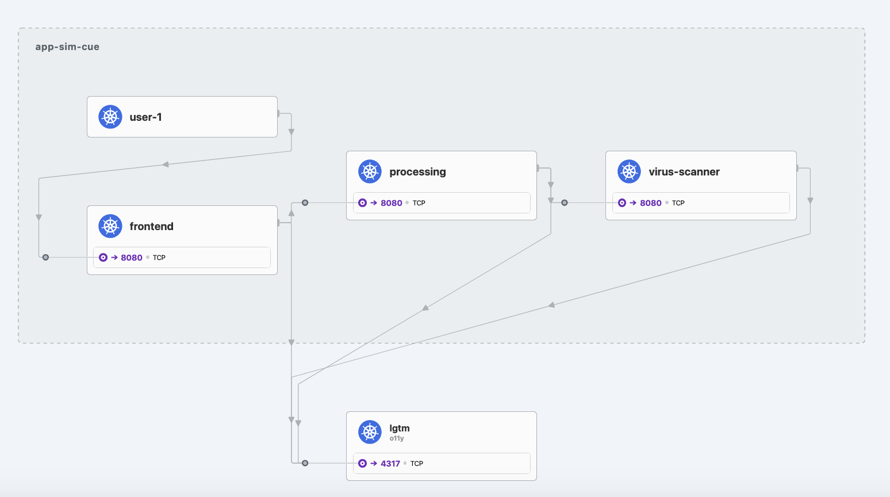
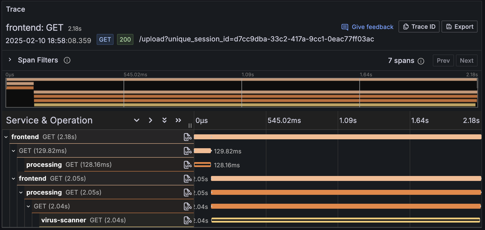

# kubernetes quick start

You can turn an [app sim config](../specification/README.md) into kubernetes
manifest files using the [k8s generator](../../scripts/generators/k8s/).

## Generate k8s manifest files

The generator is available as docker image and you can retrieve it by running

```shell
docker pull ghcr.io/cisco-open/app-simulator-generators-k8s:latest
```

To try it out, create the a file called `config.yaml` with the following content
in a new folder:

```yaml
services:
  frontend:
    type: java
    exposedPort: 3333
    endpoints:
      http:
        /upload:
          - http://processing/magicByte
          - http://processing/virus
  processing:
    type: java
    endpoints:
      http:
        /magicByte:
          - cache,128
        /virus:
          - http://virus-scanner/scan
  virus-scanner:
    type: nodejs
    endpoints:
      http:
        scan:
          - sleep,1500
          - call: error,500,Scan failed
            probability: 0.1
          - sleep,500
loaders:
  user-1:
    type: curl
    wait: 0
    sleep: 2
    urls:
      - http://frontend/upload
      - http://frontend/upload
      - http://frontend/upload
```

To generate manifest files for kubernetes from this file run

```shell
docker run --rm -t -i -v ${PWD}/deployments:/app/deployments -v ${PWD}:/mnt ghcr.io/cisco-open/app-simulator-generators-k8s:latest --config /mnt/config.yaml
```

## Run application simulation

The last step has created a set of YAML files in the `deployments` folder of
your current working directory.

To deploy the simulation into your cluster run

```shell
kubectl apply -f deployments/ --namespace app-sim
```

This will bring up the three services (`frontend`, `processing` and
`virus-scanner`) and a loader (`user-1`). Run `kubectl get pods` to verify that
all services are up and running.

The loader will continuously load from the `/upload` endpoint. You can also
reach that endpoint yourself, either by opening <http://localhost:3000/upload>
in the browser or by running the following:

```shell
curl http://localhost:3333/upload
```

> [!NOTE]
>
> If you use [minikube](https://minikube.sigs.k8s.io/docs/) make sure to run
> [`minikube tunnel`](https://minikube.sigs.k8s.io/docs/commands/tunnel/), which will create a route to services deployed with type LoadBalancer and sets their Ingress to their ClusterIP.

The files in `deployments/` that were generated now work independent of the
generator. You can use them wherever you want and you can modify them to your
needs.

## Observability with cilium Hubble

If you'd like to see a service map of the services you have just deployed, you can install
[cilium Hubble](https://github.com/cilium/hubble) into your cluster, following the instructions
to [quickly install cilium](https://docs.cilium.io/en/stable/gettingstarted/k8s-install-default/)
and to [enable the Hubble UI](https://docs.cilium.io/en/stable/observability/hubble/hubble-ui/#enable-the-hubble-ui).

For example, if you use [minikube](https://minikube.sigs.k8s.io/) you can setup your cluster as follows:

```shell
minikube start --network-plugin=cni --cni=false && cilium install && cilium hubble enable --ui && cilium status --wait
```

> [!NOTE]
>
> Since `minikube start --cni=cilium` may not install the latest version of cilium,
> the above command resolves an [issue](https://stackoverflow.com/questions/78944601/error-unable-to-enable-hubble-release-not-found) where Hubble can not be enabled, because of the
> following error:
>
> ```
> Error: Unable to enable Hubble: release: not found
> ```

With cilium and Hubble up and running, connect to the Hubble UI with the following command

```shell
cilium hubble ui
```

This will open a new browser window showing the UI. You can now select your namespace
(for example `app-sim`) from the list and see the services and their flows.



## Adding OpenTelemetry and visualize in Grafana

Using the [OpenTelemetry Operator](https://github.com/open-telemetry/opentelemetry-operator/) and [docker-otel-lgtm](https://github.com/grafana/docker-otel-lgtm) you can quickly build a minimal observability setup for your
application simulation.

To simplify this way of instrumenting your services, you can use the [otel4k8s.sh](../../../scripts/otel4k8s.sh), that you can find in the [`scripts/`](../../../scripts/) folder of this repository:

```
./otel4k8s.sh --app-namespace app-sim
```

This will take a few moments to deploy all the required components. When everything is ready, you can open <http://localhost:3000> in your browser to explore the traces,
metrics and logs of your simulation.


