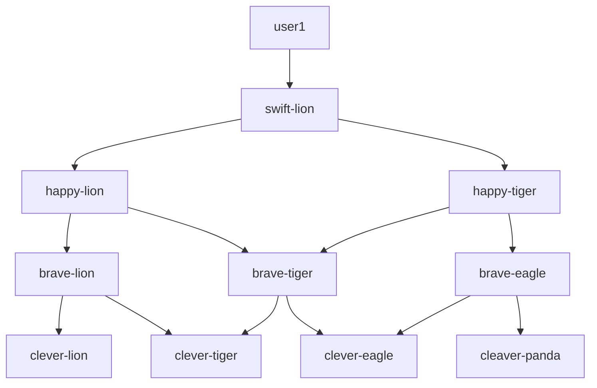
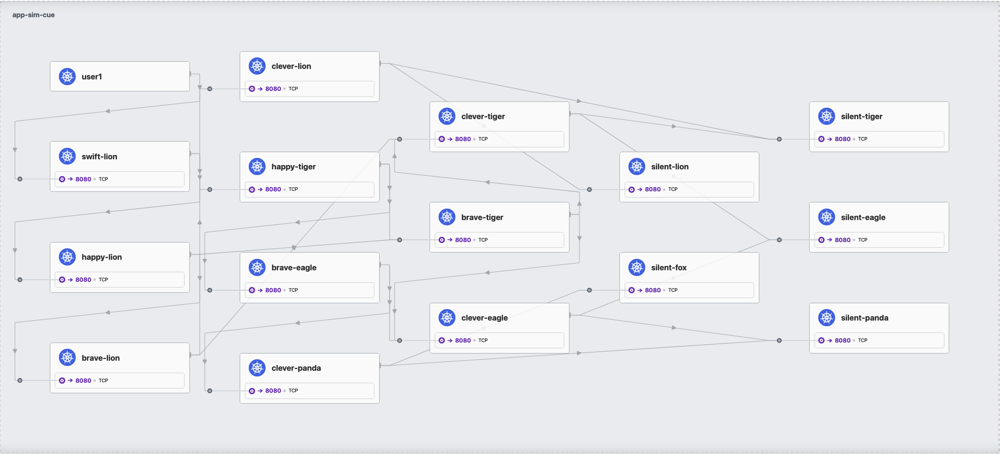

# Tutorial 5: Large deployments with cue

> [!NOTE]
>
> This tutorial is work in progress.

With application simulator you are able to describe a complex multi-service architecture without thinking about the business logic of each service that is part of your setup.
This allows you to create arbitrarily large deployments for your purposes, e.g. if you'd like to generate lots of telemetry data for your observability backend.

The only limitation that remains, is that YAML does not provide you with a level of programmability, that allows you to write a lot of similar services in one place. You have
to write them down one by one.

Instead of enriching the application simulation configuration file format with such a functionality, you can leverage configuration languages like [`pkl`](https://pkl-lang.org/), [`dhall`](https://dhall-lang.org/) or [`cue`](https://cuelang.org/).
In this tutorial we will use `cue` to demonstrate this use case.

## Requirements

Make sure you have `cue` installed locally, following [these instructions](https://cuelang.org/docs/introduction/installation/)

## Create cue file

To get started create the following file named [`large-application.cue`](../../examples/cue/large-application.cue) in an empty folder:

```cue
import "list"
import "math"

#depth: int @tag(depth,type=int)
#adjectives: ["swift", "happy", "brave", "clever", "silent", "bold", "lucky", "fierce", "gentle", "mighty", "shy", "curious", "wise", "playful", "proud", "loyal"]
#nouns: ["lion", "tiger", "eagle", "panda", "fox", "wolf", "hawk", "bear", "otter", "falcon", "rabbit", "panther", "deer", "owl", "cheetah", "dolphin"]

loaders: {
	"user1": {
		type: "curl",
		wait: 5,
		sleep: 2,
		urls: [ "http://swift-lion/next" ]
	}
}

services: {
	for x in list.Range(0, #depth+1, 1) {
		for y in list.Range(0, x+1, 1) {
			"\(#adjectives[x])-\(#nouns[y])": {
				type: "java"
				endpoints: {
					http: {
							    "/next": list.Concat([[
        for i in [y, y+1] if x < #depth {
            "http://\(#adjectives[x+1])-\(#nouns[i])/next"
        }
    ], ["sleep,\(math.Exp2(x)+(y*10))"]])
					}
				}
			}
		}
	}
}
```

## Export cue to YAML

Run the following command to generate a YAML file:

```shell
cue -t depth=3 export large-application.cue --out yaml > config.yaml
```

This will generate an application simulation configuration file with 10 services, since the `for` loop within the `services` block creates a tree of services, where each node talks to two children, until `depth` is reached:



By increasing the `depth` parameter, you can add additional layers, e.g. `depth=4` will create 15 services, `depth=5` will create 21 services and `depth=6` will create 28 services.

Additionally, each service will introduce some milliseconds of delay using `sleep` depending on their position in the tree.

We recommend that you continue the tutorial with `depth=3`. Afterwards you can increase the value step by step and check how many nodes you can run simultaneously.

## Create your k8s deployment files

To turn the application simulation configuration file from the last step into manifests for kubernetes, run the generator:

```
docker run --rm -t -i -v ${PWD}/deployments:/app/deployments -v ${PWD}:/mnt ghcr.io/cisco-open/app-simulator-generators-k8s:latest --config /mnt/config.yaml
```

This will create a folder `deployments` that will continue all the files you need to run your simulation on your cluster, using the following command:

```
kubectl create namespace app-sim-cue
kubectl apply -f deployments/ --namespace app-sim-cue
```

This will spin up your sample application. You can now use [OpenTelemetry](./5-observability-with-opentelemetry.md) or [cilium hubble](./4-observability-with-cilium-hubble.md to visualize your application.

For example, the following image shows an application with `depth=4` in cilium hubble ui:


